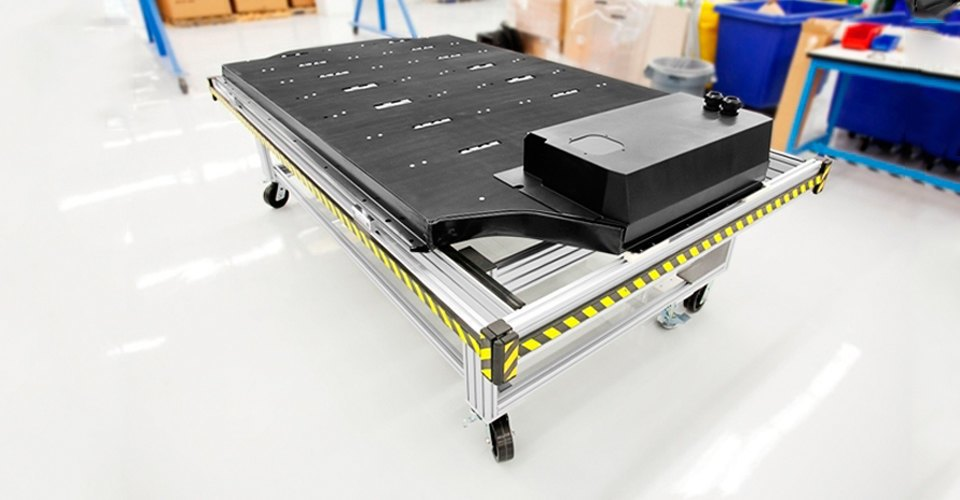
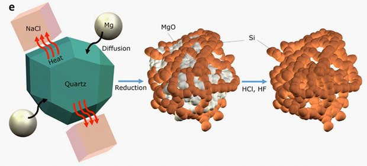
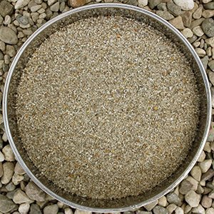
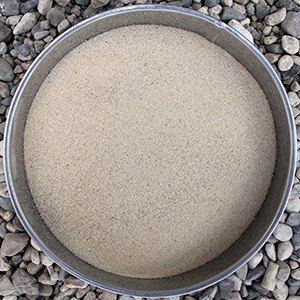
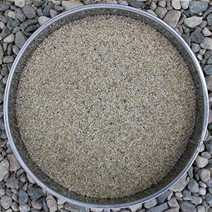
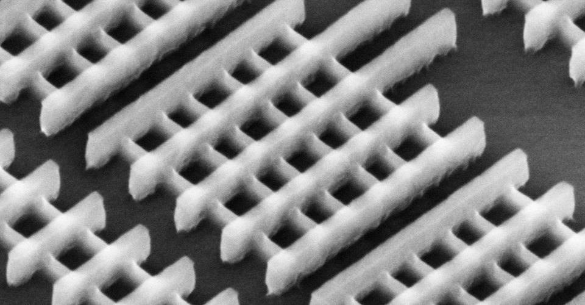

# Why smartphones and notebooks run down so fast
## How nano-silicon will help battery manufacturers

On July 8, a study of the University of California at Riverside staff appeared on the Scientific Reports website. It shows that nano-silicon obtained from quartz sand, 3 times increases the operating time of lithium-ion batteries, which are now used in most electronic devices. At the same time, IBM seems to intend to abandon silicon in chip production: the company has invested 3 billion dollars in the study, one of the objectives of which is to create an alternative technology. We found out why silicon is being switched to silicon in one industry, and silicon is being abandoned in another.

LITHIUM-ION BATTERIES APPEARED IN CONSUMER ELECTRONICS IN THE EARLY 1990S. Since then, they have been continuously improved, and until recently they have kept pace with the development of portable devices. But over the past few years, mobile technology has made such a leap, and the requirements for technology have grown so much that many manufacturers of handheld electronics had to compromise on principles and start producing products that work on a single charge much less than before. The simplest example is a cell phone that used to be charged once every few days, but now every day, and especially active users twice a day. Most of the time is increased by optimizations - both at the software and hardware levels.

IMPORTANT OF LITHIUM ION ACCOUNTS LIMITED to the MATERIALS that make up the electrodes - the lithium ions that power the devices move there. Materials based on lithium are usually used as a negative electrode (cathode) and graphite as a positive electrode (anode). When you charge the battery, the ions move from cathode to anode, and when it is discharged, the ions move in the opposite direction, which creates electricity. Graphite can hold relatively few ions, so the capacity of the battery leaves much to be desired.

## How will silicon increase battery life?

 
Silicon Anode From Theoretical Anode can hold up to 10 times as many ions as the graphite anode in practice - 3 times as many. Scientists have known this for a long time, but the problem was that the silicon that absorbed the ions was four times larger - not good for a battery. In addition, silicon was difficult to produce in large quantities, because it decayed quickly.

Researchers at the University of California came up with a way to cheaply produce porous silicon, which only increases in size by a third from its charge. The idea came six months ago to the inventor Zachary Favors, when he was resting on a beach in California. The scientist decided that silicon can be obtained from quartz sand. To do this, you need to clean and grind the sand, mix it with salt and magnesium, and then heat it. In the course of a chemical reaction, the salt will absorb heat, and magnesium and quartz will produce pure nano-silicon with a porous structure. If you charge the nano-silicon with ions, the pores will be filled, and in absolute terms, it will enlarge slightly.

